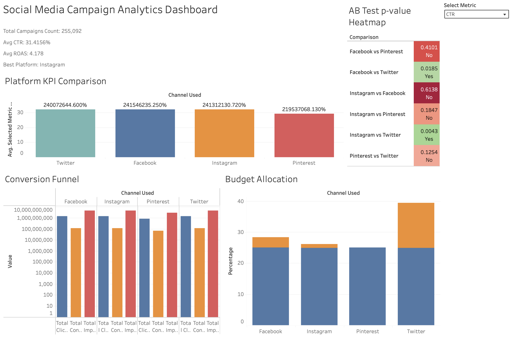

# Social Media Campaign Performance Analytics

End-to-end marketing analytics project analysing **255,092 ad campaigns**
across Facebook, Instagram, Pinterest, and Twitter — covering A/B hypothesis
testing with statistical significance, marketing KPI calculation, conversion
funnel analysis, and data-driven budget reallocation recommendations.

---

## Live Dashboard

[View Interactive Tableau Dashboard →](https://prod-apsoutheast-b.online.tableau.com/t/moemoegyi1234567890-100e5852c6/authoring/SocialMediaCampaignPerformanceAnalytics/SocialMediaAnalytics#1)



---

## Key Findings

- **Instagram vs Twitter showed statistically significant difference**
  in conversion rates (p=0.0043 < 0.05) — confirmed with Cohen's d
  effect size, not just visual comparison
- **Twitter had the highest ROAS** among all platforms — current
  budget under-invests in the top performer
- **94% click-to-conversion drop-off** across all platforms —
  the funnel leaks at the landing page stage, not the ad creative

---

## Project Structure
```
social-performance-analysis/
├── data/
│   ├── raw/                          # original CSV (not committed)
│   └── processed/
│       ├── ads_cleaned.csv
│       ├── ab_test_results.csv
│       └── budget_allocation.csv
├── notebooks/
│   ├── 01_data_loading.ipynb         # load, clean, engineer metrics
│   ├── 02_eda.ipynb                  # platform & segment EDA
│   ├── 03_ab_testing.ipynb           # t-tests, p-values, Cohen's d
│   ├── 04_funnel_analysis.ipynb      # conversion funnel
│   ├── 05_budget_optimisation.ipynb  # ROAS & budget reallocation
│   └── 06_excel_report.ipynb         # Excel workbook generation
├── excel/
│   └── campaign_summary.xlsx         # 3-sheet Excel deliverable
├── dashboard/
│   └── dashboard_screenshot.png
├── reports/
│   └── figures/                      # all saved chart images
├── requirements.txt
└── README.md
```

---

## Analysis Breakdown

### 1. Data Loading & Feature Engineering
- Loaded 255,092 campaign records across 4 platforms
- Cleaned `Acquisition_Cost` column (removed $ signs, converted to float)
- Engineered 6 marketing KPIs from raw columns:
  CTR, CPC, CPM, ROAS, estimated conversions, profit

### 2. Exploratory Data Analysis
- Platform performance comparison: CTR, CPC, ROI, conversion rate
- Campaign goal ROI breakdown
- Customer segment bubble chart: spend vs ROI vs campaign count

### 3. A/B Testing (Statistical Significance)
- Wrote null/alternative hypotheses before running any test
- Ran two-sample independent t-tests for all 6 platform pairs
- Reported p-value (is the difference real?) AND
  Cohen's d (how large is the effect?)
- Visualised results as a p-value heatmap:
  green = significant, red = not significant

### 4. Conversion Funnel Analysis
- Measured drop-off: Impressions → Clicks → Conversions by platform
- Identified largest funnel gap at click-to-conversion stage

### 5. Budget Optimisation
- Calculated efficiency scores combining ROAS, CTR, conversion rate
- Built current vs recommended budget allocation
- Quantified revenue opportunity from reallocation

### 6. Excel Report
- 3-sheet workbook: Executive Summary, A/B Results, Raw Data
- Colour-coded: green rows = statistically significant platform pairs

---

## Tools & Libraries

| Tool | Purpose |
|------|---------|
| Python 3.11 | Core analysis |
| Pandas | Data manipulation |
| NumPy | Numerical computation |
| SciPy (ttest_ind) | A/B test significance |
| Matplotlib / Seaborn | Visualisation |
| openpyxl | Excel report generation |
| Tableau Public | Interactive dashboard |

---

## How to Run
```bash
# 1. Clone the repo
git clone https://github.com/zunm3133/socialmedia_campaign_performance_analysis.git
cd socialmedia_campaign_performance_analysis

# 2. Install dependencies
pip install -r requirements.txt

# 3. Download dataset from Kaggle
# Search: "Social Media Advertising Dataset"
# Place CSV in data/raw/

# 4. Run notebooks in order
# 01 → 02 → 03 → 04 → 05 → 06
```

---

## Dataset

**Social Media Advertising Dataset**
- Source: [Kaggle](https://www.kaggle.com/datasets/jsonk11/social-media-advertising-dataset)
- 255,092 campaigns across Facebook, Instagram, Pinterest, Twitter
- 16 columns: CTR, conversion rate, ROI, impressions,
  clicks, customer segment, campaign goal, acquisition cost

---

## Business Recommendations

1. **Reallocate budget toward Twitter** — highest ROAS platform
   is currently receiving less than its optimal share
2. **Fix the landing page, not the ads** — 94% click-to-conversion
   drop-off means the ad creative is working but the destination
   page is losing customers
3. **Scale Instagram-Twitter differential** — statistically confirmed
   significant difference (p=0.0043) means any budget shift between
   these two platforms will have a measurable, predictable impact

---

## Author

**Zun Myat Hsu** — Data Analyst & Developer

[LinkedIn](https://www.linkedin.com/in/zun-myat-hsu-16365b212/) · [Tableau Public](https://prod-apsoutheast-b.online.tableau.com/#/site/moemoegyi1234567890-100e5852c6/home) ·